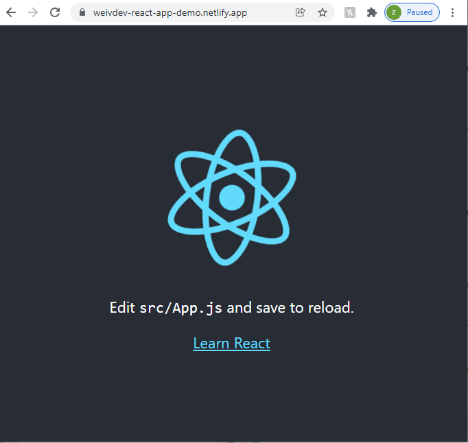
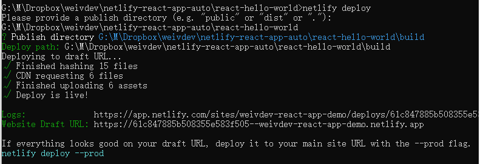
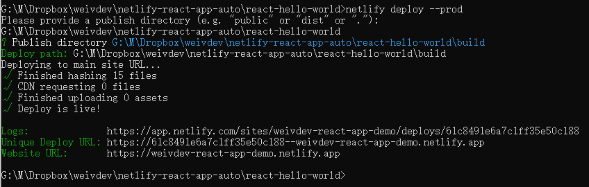

# netlify-react-app-auto
To create a helloworld react app and deploy to Netlify 🍵

## Env Preparation
- Download node.js if not yet: https://nodejs.org/en/download/
- Install npm if not yet: run `$ npm install`
- `$ npm install -g create-react-app`
- `$ npm install netlify-cli -g`

## Create React App 
Open local terminal and `cd` to the folder containing this `README.md`
- `$ create-react-app react-hello-world`
- `$ cd react-hello-world`
- `$ npm run build`

you will see `/react-hello-world/build` folder, this will be used in Netlify Deployment 

## Deploy to Netlify
Need to firstly register and login Netlify https://www.netlify.com/
- `$ netlify deploy`
    * Choose `+  Create & configure a new site` and press enter
    * Choose `Team: weivdev` and press enter
    * input new unique site name `weivdev-react-app-demo` and press enter
    * input the Deploy path `./build` 
        The draft website is now published:
        

If you are happy about the draft website above, then deploy to prod:
- `$ netlify deploy --prod`
    * input the Deploy path `./build` 
        The prod website is now published:
        
        
- Can now open the Website https://weivdev-react-app-demo.netlify.app 🙋

## Launch localhost to work on real-time local changes
- `$ npm run start`

- You can now open http://localhost:3000/ 🙋